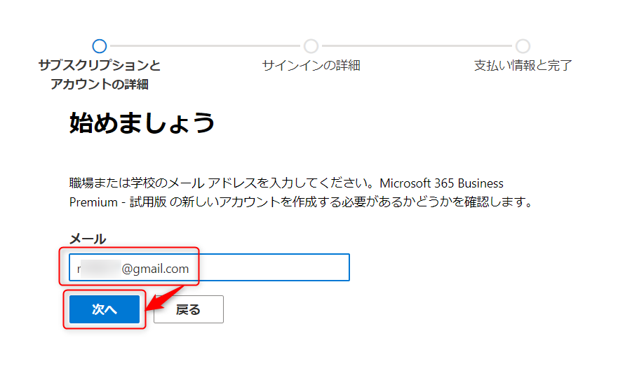

# docs-ext-M365Trial
M365評価版作成手順

# Microsoft 365 試用版の取得

職場・組織アカウントにサインインしていると、試用版の取得ができません。
試用版を取得する際は、プライベートブラウザからアクセスしてください。

1. [Microsoft 365 の製品ページ](https://www.microsoft.com/ja-jp/microsoft-365/business/compare-all-microsoft-365-business-products?tab=2&rtc=1) にアクセスします。

    

2. 「次へ」をクリックします。

    

3. メールアドレスを入力し、「次へ」をクリックします。

    

4. 「アカウントのセットアップ」をクリックします。

    

5. 姓名、勤務先の電話番号、会社名、会社規模を入力します。

    

    ※ここで勤務先の電話番号をご自身のスマートフォンの番号にしておくと、7 の画面で電話番号が自動入力されます。

6. 「次へ」をクリックします。

    

7. 「確認コードを送信」をクリックします。

    

8. スマートフォンに SMS で認証コードが届きます。

    

9. 6桁の認証コードを入力し、「確認」をクリックします。

    

10. パスワードを設定し、「次へ」をクリックします。

    

    ※設定が完了すると、以下の画面に遷移しますが、この画面は触らないでください。

    

# Microsoft 365 管理センターへのアクセス
1. 新しいタブを開きます
2. 以下のURLを貼り付けて、Enterキーを押下します。

    ```
    https://www.office.com/
    ```
    
    

3. 警告が表示された状態で Microsoft 365 のホームが開きます。

    

4. 左メニューの「管理」をクリックします。

    

5. Microsoft 365 管理センターが開きます。

    

# 必要情報の登録
ライセンス取得に必要な情報を登録します。

## 販売先住所の登録
販売先（ライセンスを取得する会社）の住所を登録します。
会社の住所で登録してください。

1. 課金情報 ＞ 請求対象アカウント をクリックします。

    

2. アカウント名をクリックします。

    

3. 「編集」をクリックします。

    

4. 右側に入力画面が開きます。

    

5. 郵便番号・都道府県・市区町村・町名、番地 を入力し、「保存」をクリックします。

    
    ※会社の住所などをご利用ください。

6. 「×」をクリックして、右側のウィンドウを閉じます。

    

## 支払情報の登録
支払いに使用するクレジットカードの登録です。
試用版を取得するにあたり、登録が必要なフローになっていますが、自動的に支払われることはありません。

1. 課金情報 ＞ 支払い方法 をクリックします。

    

2. 「お支払い方法を追加」をクリックします。

    

3. 右側に「支払方法を追加する」というウィンドウが出ます。

    

4. カード番号・セキュリティコード・有効期限・クレジットカードの名義を入力します。

    

5. 下にスクロールし、請求先の郵便番号・都道府県・市区町村・町名、番地を入力します。

    

6. 「保存」をクリックします。

    

7. 「閉じる」をクリックします。

    

8. 支払情報が登録されているのを確認します。

    


# ライセンスの割り当て
## Microsoft 365 Business Premium を取得する

2. 課金情報 ＞ サービスを購入する をクリックします。

    

3. 下にスクロールし、 Microsoft 365 Business Premium の「詳細」をクリックします。

    

4. 「無料試用の開始」をクリックします。

    

5. 右側のプルダウンで「(＋81日本)」を選択します。

    

6. ご自身のスマートフォンの電話番号を入力し、「自分にテキスト送信」をクリックします。

    

7. 認証コードを入力し、「無料試用版の開始」をクリックします。

    

8. 「無料トライアル」をクリックします。

    

9. 「続行」をクリックします。

    

10. Microsoft 365 管理センターのホーム画面に戻ります。

    

## Power Apps Premium を取得する
1. 課金情報 ＞ サービスを購入する をクリックします。

    

2. すべての製品カテゴリを検索 に「Power Apps」と入力し、Enter キーを押下します。

    

3. 下にスクロールし、Power Apps Premium の「詳細」をクリックします。

    

4. 「無料試用の開始」をクリックします。

    

5. 「無料トライアル」をクリックします。

    

6. 「ユーザー」をクリックします。

    

7. アクティブなユーザーの画面に遷移します。

    

## ライセンスを割り当てる

1. アカウントをクリックします。

    

2. 右側の詳細画面が出ますので、「ライセンスとアプリ」をクリックします。

    

3. Microsoft 365 Business Premium と Power Apps Premium の両方にチェックを入れて、「変更の保存」をクリックします。

    

4. 「変更内容が保存されました」という表示が出たら、× をクリックして閉じます。

    

5. Microsoft 365 のホーム画面のタブに戻り、ブラウザの更新ボタンを押します。

    

    ※タブを閉じてしまった方は以下の URL からアクセスしてください。

    ```
    https://www.office.com/
    ```

6. ホーム画面に表示されていた警告が消えます。

    


